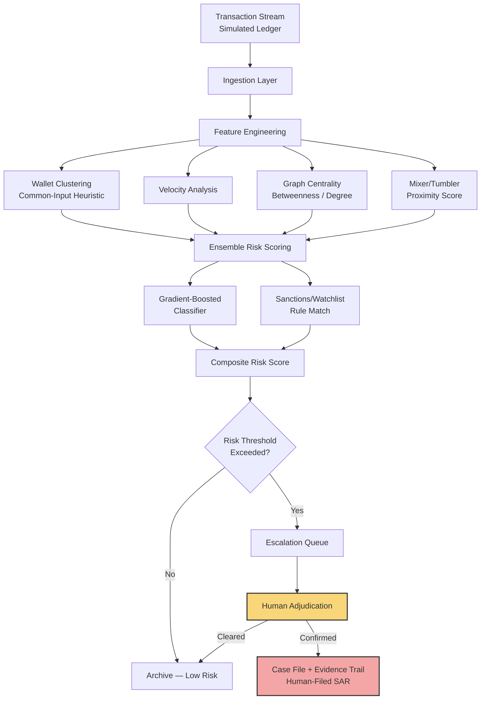

# ADR-010: AEGIS — On-Chain Fraud & AML Detection Engine

**Status:** Accepted
**Module:** 10
**Portfolio:** ai-engineering-portfolio
**Author:** Geoffrey Okwi (Jones)
**Date:** 2026-08-19

---

## Context

Financial institutions, exchanges, and custodians expanding into digital assets need transaction-monitoring systems that can detect money-laundering typologies (layering, peel chains, smurfing, mixer/tumbler proximity) on-chain, at a scale and velocity that manual review cannot match. Regulatory pressure (FATF Travel Rule, OFAC sanctions screening, FinCEN guidance) is accelerating demand for AML tooling purpose-built for blockchain transaction graphs, distinct from traditional card/ACH fraud detection.

This module extends the real-time fraud detection architecture proven in **Module 6 (Sentry)** into the on-chain domain, and adopts the **zero-autonomous-tier authority boundary** established in **Module 8 (Vigil)**: the system detects, scores, and escalates — it never freezes funds, blocks transactions, or files regulatory reports autonomously. All enforcement actions require human adjudication.

## Decision

Build AEGIS as a graph-native transaction monitoring engine with four stages:

1. **Ingestion** — synthetic/simulated transaction stream (wallet-to-wallet transfers, exchange deposits/withdrawals) modeling a realistic blockchain ledger.
2. **Feature Engineering** — wallet clustering (common-input-ownership heuristic), transaction velocity, graph centrality (betweenness/degree), mixer/tumbler proximity scoring, counterparty risk propagation.
3. **Ensemble Risk Scoring** — gradient-boosted classifier + rule-based sanctions/watchlist matching, combined into a composite risk score (mirrors the P1 Pipeline Integrity Monitor's multi-engine composite scoring pattern).
4. **Escalation Queue** — human-in-the-loop case management; no autonomous fund-freezing or auto-filed SARs (Suspicious Activity Reports).

## Authority Boundary (Governance)

| Tier | Action | Autonomous? |
|---|---|---|
| 0 | Ingest & score transactions | Yes |
| 1 | Flag transaction for review | Yes |
| 2 | Populate escalation queue with evidence trail | Yes |
| 3 | Freeze wallet / file SAR / notify regulator | **No — human adjudication required** |

This mirrors Vigil's design: AEGIS is a decision-support system, not a decision-making system.

## Consequences

**Positive**
- Direct architectural lineage from Sentry (fraud) → AEGIS (on-chain AML) demonstrates systems thinking and domain generalization, not a one-off project.
- Governance boundary reinforces the responsible-AI thread running through the portfolio (Vigil, AEGIS).
- Addresses a hiring category with sustained demand: exchanges, custodians, and banks standing up crypto desks all need AML tooling.

**Trade-offs**
- Synthetic transaction graphs (no real on-chain data pull) — acceptable for portfolio demonstration; real deployment would integrate a chain-indexing API (e.g., a node provider or analytics API).
- Wallet clustering heuristics are simplified versions of production techniques (full implementations are proprietary to firms like Chainalysis/Elliptic) — module makes this scoping explicit rather than overclaiming capability.

## Alternatives Considered

- **DeFi risk/liquidity analytics** — rejected: pulls toward quant-trading talent pool, weaker fit with safety-critical systems narrative.
- **Crypto market-making engine** — rejected: same reason, plus less regulatory-tailwind hiring demand.
- **Stablecoin/CBDC settlement infra** — rejected: stronger payments-infra angle than AI/ML showcase; may revisit as a future module if settlement-layer AI monitoring becomes a distinct opportunity.

---

## Architecture Diagram



---

## Folder Tree

```
ai-engineering-portfolio/
└── module-10-aegis/
    ├── README.md
    ├── docs/
    │   ├── ADR-010-aegis.md
    │   └── architecture-diagram.mmd
    ├── src/
    │   ├── __init__.py
    │   ├── ingestion/
    │   │   ├── __init__.py
    │   │   └── transaction_simulator.py
    │   ├── features/
    │   │   ├── __init__.py
    │   │   ├── wallet_clustering.py
    │   │   ├── velocity.py
    │   │   ├── graph_centrality.py
    │   │   └── mixer_proximity.py
    │   ├── scoring/
    │   │   ├── __init__.py
    │   │   ├── ensemble_classifier.py
    │   │   ├── sanctions_matcher.py
    │   │   └── composite_score.py
    │   ├── simulation/
    │   │   ├── __init__.py
    │   │   ├── typology_generator.py   # layering, peel chains, smurfing
    │   │   └── discrete_event_engine.py
    │   └── governance/
    │       ├── __init__.py
    │       └── authority_boundary.py
    ├── dashboard/
    │   └── streamlit_app.py
    ├── data/
    │   └── synthetic_ledger/
    ├── tests/
    │   ├── test_features.py
    │   ├── test_scoring.py
    │   └── test_simulation.py
    ├── requirements.txt
    ├── pyproject.toml
    └── .streamlit/
        └── config.toml
```

---

## Next Steps

1. Build `transaction_simulator.py` — synthetic ledger with injected laundering typologies.
2. Implement feature engineering modules (clustering, velocity, centrality, mixer proximity).
3. Train/validate ensemble risk scorer against injected typologies (target: full scenario detection, mirroring P1 and Vigil pass-rate standards).
4. Build Streamlit dashboard — transaction graph viz, risk heatmap, escalation queue, explainability panel.
5. Deploy to Streamlit Cloud.