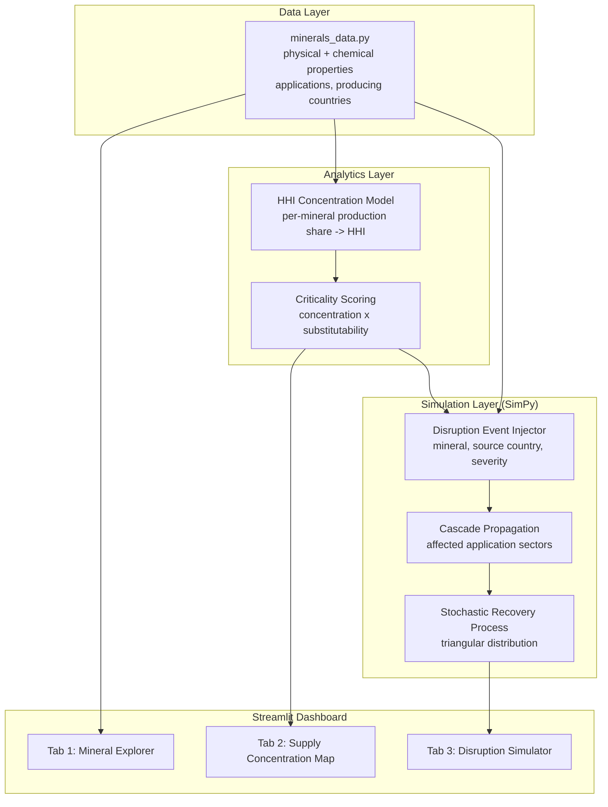

# Bastion — Architecture Diagram

```mermaid
flowchart TD
    subgraph Data["Data Layer"]
        A["minerals_data.py<br/>physical + chemical properties<br/>applications, producing countries"]
    end

    subgraph Analytics["Analytics Layer"]
        B["HHI Concentration Model<br/>per-mineral production share -> HHI"]
        C["Criticality Scoring<br/>concentration x substitutability"]
    end

    subgraph Simulation["Simulation Layer (SimPy)"]
        D["Disruption Event Injector<br/>mineral, source country, severity"]
        E["Cascade Propagation<br/>affected application sectors"]
        F["Stochastic Recovery Process<br/>triangular distribution"]
    end

    subgraph Dashboard["Streamlit Dashboard"]
        G["Tab 1: Mineral Explorer"]
        H["Tab 2: Supply Concentration Map"]
        I["Tab 3: Disruption Simulator"]
    end

    A --> B
    A --> G
    B --> C
    C --> H
    A --> D
    D --> E
    E --> F
    F --> I
    C --> D
```