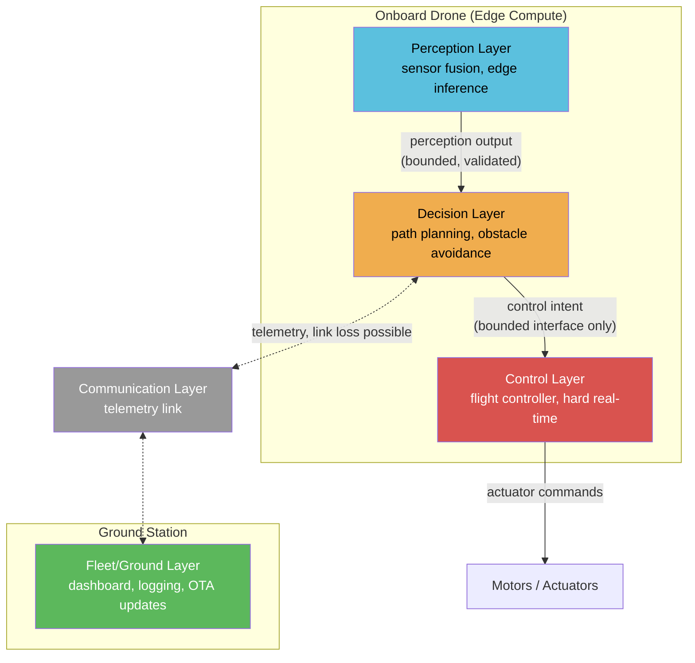
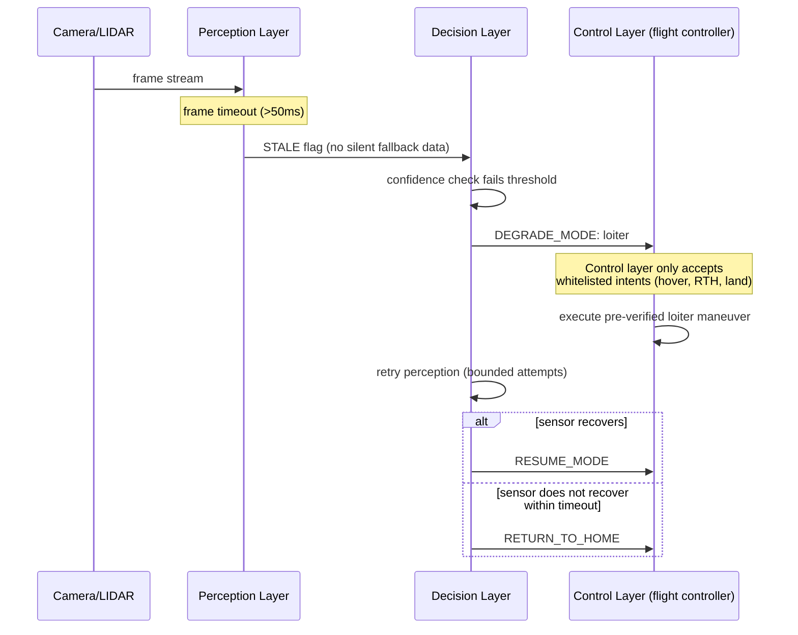

| Module | Focus | Live App | Status |
|---|---|---|---|
| [Module 1](module1-react-agent/) | ReAct Agent (LangGraph, Groq) | [module1.streamlit.app](https://module1.streamlit.app) | ✅ Live |
| [Module 2](module2-multi-agent-rag/) | Multi-Agent Supervisor + HybridRAG | [module2.streamlit.app](https://module2.streamlit.app) | ✅ Live |
| [Module 3](module3-mlops-pipeline/) | MLOps Pipeline (MLflow, Prometheus, ECS) | [module3.streamlit.app](https://module3.streamlit.app) | ✅ Live |
| [Module 4](module4-quantum-ai-explorer/) | Quantum AI Explorer (Qiskit) | [module4.streamlit.app](https://module4.streamlit.app) | ✅ Live |
| [Module 5](module5-drone-architecture/) | Sentinel Architecture — Safety-Critical Systems Design | [module5.streamlit.app](https://module5.streamlit.app) | ✅ Live |

## Module 5: Sentinel Architecture
**System Architecture for Safety-Critical Autonomous Drone AI**

A departure from agent-building into systems architecture: this module demonstrates designing
AI systems whose failures have physical consequences, not just bad predictions. It consists of
4 Architecture Decision Records (ADRs), 2 system diagrams, and a discrete-event simulation
(8/8 scenarios passing) that proves — in code, not just in prose — that the AI/flight-control
safety boundary holds under adversarial and degraded conditions.

**Key decisions documented:**
- AI never has direct write access to the flight-control loop (whitelisted intent interface)
- Per-layer latency budgets with fail-fast behavior
- A four-state degradation ladder (NOMINAL → DEGRADED → LOST → FAIL_SAFE)
- Compound-failure escalation, closing a gap found during the module's own validation process

**Stack:** Python 3.11, Streamlit
**Live app:** [module5.streamlit.app](https://module5.streamlit.app)
**Details:** [module5-drone-architecture/README.md](module5-drone-architecture/README.md)
# Module 5: Sentinel Architecture
### System Architecture for Safety-Critical Autonomous Drone AI

**Author:** Jones (AI/ML Engineer)
**Portfolio:** [ai-engineering-portfolio](https://github.com/joneslokouba-ui/ai-engineering-portfolio)
**Domain:** Autonomous drone fleets — real-time control, edge AI, fail-safe design

---

## Why This Module Exists

Modules 1–4 demonstrated agent design, multi-agent orchestration, MLOps pipelines, and quantum
ML. This module demonstrates a different, senior-level skill: **designing AI systems that must
not fail catastrophically** — where a model's mistake has physical consequences, not just a bad
prediction.

The deliverable is not a flight simulator. It is an **architecture decision record (ADR) set**
and a **minimal simulation** that proves the most important decision — the fail-safe boundary
between AI and flight control — actually holds under failure conditions.

---

## System Overview

Five layers, each with a distinct trust and latency profile:



**The single most important line in this diagram is the arrow from Decision → Control.** It is
deliberately drawn as a narrow, bounded interface, not a direct write path. That constraint is
the subject of [ADR-001](adr/ADR-001-failsafe-boundary.md).

---

## Architecture Decision Records

| ADR | Decision | Status |
|---|---|---|
| [ADR-001](adr/ADR-001-failsafe-boundary.md) | AI/ML never has direct write access to the flight-control loop | Accepted |
| [ADR-002](adr/ADR-002-latency-budget.md) | End-to-end latency budget decomposition across layers | Accepted |
| [ADR-003](adr/ADR-003-degradation-modes.md) | Explicit degradation ladder for sensor/model/comms failure | Accepted |
| [ADR-004](adr/ADR-004-failsafe-escalation.md) | Simultaneous independent LOST states escalate to FAIL_SAFE | Accepted |

ADR-004 closes a gap surfaced during simulation validation of ADR-003 — see its "Context" section
for the finding and fix. This is a useful example of the ADR process working as intended: a
validation result fed back into the architecture, not just the code.

More ADRs (edge/cloud split, fleet coordination, OTA model updates) will be added as the module
develops. See the ADR template in `adr/ADR-000-template.md`.

---

## Failure Scenario: Sensor Dropout → Safe Landing



This sequence is what `sim/failsafe_sim.py` will validate in code (see ADR-001, "Validation"
section) — not through a physics simulation, but through a discrete-event model that proves the
Control layer never executes an intent outside its whitelist, even under adversarial/garbage
input from the Decision layer.

---

## Repository Structure

```
module5-drone-architecture/
├── README.md                  ← you are here
├── adr/
│   ├── ADR-000-template.md
│   ├── ADR-001-failsafe-boundary.md
│   ├── ADR-002-latency-budget.md
│   └── ADR-003-degradation-modes.md
├── diagrams/
│   └── (source diagrams, mirrored from README for standalone viewing)
└── sim/
    └── failsafe_sim.py        ← minimal proof, not yet built
```

---

## Next Steps

1. Build `sim/failsafe_sim.py` to demonstrate ADR-001 and ADR-003 in code.
2. Add ADR-004 (edge vs. cloud compute split) and ADR-005 (fleet coordination).
3. Streamlit dashboard wrapping the simulation, consistent with Modules 1–4 deployment pattern.
4. Portfolio story tab explaining the tradeoffs for a non-specialist reader (hiring manager).