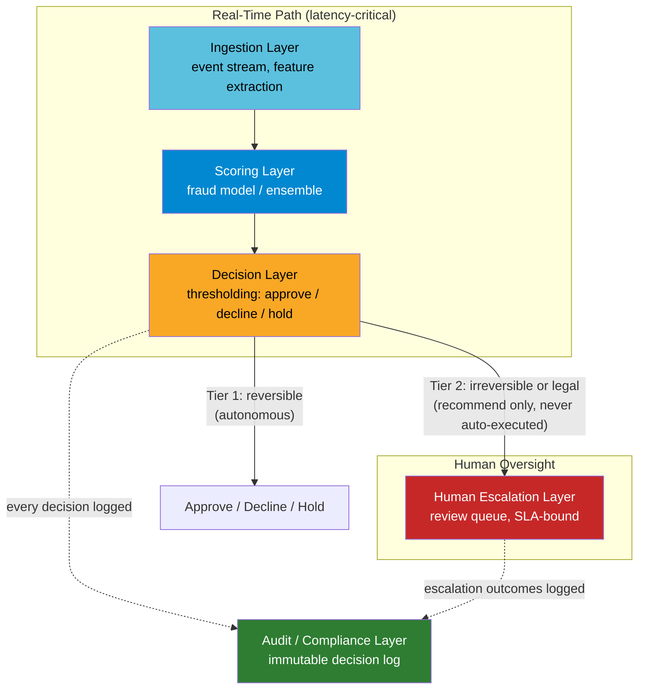

# Module 6: Sentry Architecture
### System Architecture for Real-Time Fraud & Anomaly Detection

**Author:** Jones (AI/ML Engineer)
**Portfolio:** [ai-engineering-portfolio](https://github.com/joneslokouba-ui/ai-engineering-portfolio)
**Domain:** Real-time transaction fraud screening — regulated, low-latency, dual-sided error cost

---

## Why This Module Exists

Module 5 (Sentinel Architecture) proved a system design for AI whose mistakes have *physical*
consequences. This module proves the adjacent but distinct skill: designing AI systems whose
mistakes have *financial and legal* consequences — where a false positive harms a legitimate
customer and a false negative lets fraud through, and both failure directions carry real cost.

The deliverable is the same shape as Module 5: an ADR set documenting the hard architectural
decisions, diagrams, and a discrete-event simulation that proves the key decisions hold under
adversarial and degraded conditions — not a production fraud model.

---

## System Overview



**The arrow from Decision → Human Escalation for Tier 2 actions is this module's equivalent of
Module 5's Decision → Control boundary.** It is the single decision that bounds the system's
blast radius on a model error. See [ADR-001](adr/ADR-001-authority-boundary.md).

---

## Architecture Decision Records

| ADR | Decision | Status |
|---|---|---|
| [ADR-001](adr/ADR-001-authority-boundary.md) | Model never has autonomous authority over irreversible or legally consequential actions | Accepted |
| [ADR-002](adr/ADR-002-latency-budget.md) | End-to-end latency budget decomposed and enforced per layer | Accepted |
| [ADR-003](adr/ADR-003-failopen-failclosed.md) | Fail-closed by default on scoring timeout, with a narrow pre-approved fail-open exception | Accepted |
| [ADR-004](adr/ADR-004-asymmetric-error-handling.md) | False positives and false negatives handled as distinct, independently-tunable paths | Accepted |
| [ADR-005](adr/ADR-005-audit-explainability.md) | Every decision requires a synchronous, guaranteed-delivery audit record; audit failure is treated as a scoring failure | Accepted |

Core architecture coverage is now complete (5 ADRs), matching Module 5's depth before its
simulation and dashboard phase.

---

## Simulation: Proving the ADRs Hold

`sim/sentry_sim.py` is a discrete-event proof (not a production model) validating all five ADRs
against 10 scenarios, all passing:

| # | Scenario | ADR |
|---|---|---|
| 1 | Nominal low score → APPROVE | baseline |
| 2 | High score → DECLINE | baseline |
| 3 | Mid-range score → HOLD_FOR_REVIEW (friction band) | ADR-004 |
| 4 | Timeout, high amount/untrusted → HOLD_FOR_REVIEW | ADR-003 (fail-closed default) |
| 5 | Timeout, low amount/trusted/fresh → APPROVE | ADR-003 (bounded fail-open exception) |
| 6 | Timeout, amount just above exception threshold → HOLD_FOR_REVIEW | ADR-003 (boundary enforcement) |
| 7 | Timeout, stale trust cache → HOLD_FOR_REVIEW | ADR-003 (stale ≠ trusted) |
| 8 | Adversarial Tier 2 request → routed to human escalation, never auto-executed | **ADR-001 (core claim)** |
| 9 | Threshold change alters outcome; each record captures its own config | ADR-004 |
| 10 | Audit write failure downgrades an otherwise-APPROVE decision | **ADR-005 (core claim)** |

Run it yourself:
```bash
cd module6-fraud-architecture/sim
python sentry_sim.py
```

---

## Repository Structure

```
module6-fraud-architecture/
├── README.md                          ← you are here
├── adr/
│   ├── ADR-001-authority-boundary.md
│   ├── ADR-002-latency-budget.md
│   ├── ADR-003-failopen-failclosed.md
│   ├── ADR-004-asymmetric-error-handling.md
│   └── ADR-005-audit-explainability.md
├── diagrams/
│   └── (source diagrams, mirrored from README for standalone viewing)
└── sim/
    └── sentry_sim.py                  ← 10/10 scenarios passing
```

---

## Next Steps

1. Streamlit dashboard, scoped honestly to whatever is actually built (same discipline as
   Module 5) — ADR browser, live decision simulator, and one-click test suite runner.