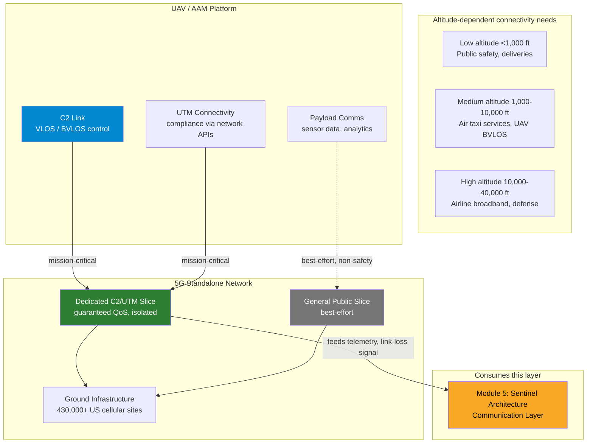

# Module 7: Skylink Architecture
### Digital Airspace Connectivity — the Communication Layer Module 5 Left Abstract

**Author:** Jones (AI/ML Engineer)
**Portfolio:** [ai-engineering-portfolio](https://github.com/joneslokouba-ui/ai-engineering-portfolio)
**Domain:** 5G Standalone connectivity for low/medium-altitude UAV and AAM operations
**Built in:** Python (PyCharm) — see note below on why, not C++

---

## Why This Module Exists

Module 5 (Sentinel Architecture) drew a system diagram with a **Communication Layer** box —
"drone-to-ground telemetry, link loss possible" — and deliberately left it abstract, because that
module's focus was the AI/flight-control safety boundary, not the physics or network architecture
of the radio link itself. Module 7 builds out exactly that box: how a UAV's Command & Control
(C2) link, payload telemetry, and UTM connectivity are actually carried over a real network — and
what happens architecturally when that network is congested, degraded, or unavailable.

This module is grounded in Ericsson's public "5G — A key enabler for Air Traffic Control" paper
(2025), which documents 5G Standalone's role in FAA airspace modernization: sub-10ms latency for
collision avoidance, network slicing for mission-critical isolation, and three deployment models
(FAA Private Network, MNO Network Slice, Hybrid).

**A note on tooling:** this module is built entirely in Python, not C++. The physics involved —
free-space path loss, Doppler shift, antenna gain patterns, handover-latency modeling — is pure
math, and `numpy`/`scipy` handle it without any loss of technical credibility. C++ earns its place
in a portfolio when the claim is about a real-time embedded control loop on constrained hardware
(as in Module 5's flight controller). Modeling RF propagation and network architecture doesn't
need that; it needs correct math and clear architecture, which Python does well and keeps this
module consistent with the rest of the portfolio's tooling and deployment pattern.

---

## System Overview



**The separation between the dedicated C2/UTM slice and the general public slice is this
module's flagship decision** — the network-layer equivalent of Module 5's AI/flight-control
boundary. See [ADR-001](adr/ADR-001-network-slice-isolation.md).

---

## Architecture Decision Records

| ADR | Decision | Status |
|---|---|---|
| [ADR-001](adr/ADR-001-network-slice-isolation.md) | Mission-critical C2/UTM traffic is isolated via dedicated network slice, never sharing a path with general public traffic | Accepted |
| [ADR-002](adr/ADR-002-deployment-model-selection.md) | Deployment model (FAA Private / MNO Slice / Hybrid) is selected by zone classification, not applied uniformly nationwide | Accepted |
| [ADR-003](adr/ADR-003-aerial-handover-mobility.md) | Aerial UEs use a dedicated cell layer with bounded handover latency, not default ground-optimized mobility logic | Accepted |
| [ADR-004](adr/ADR-004-isac-drone-detection.md) | ISAC drone detection is resource-subordinate to the C2/UTM slice, and requires multi-static corroboration before affecting any connected UAV's state | Accepted |

Core architecture coverage is now 4 ADRs. ADR-004 is the third instance across this portfolio of
the same "propose, never command" authority pattern — after Module 5's ADR-001 and Module 6's
ADR-001/ADR-006 — now applied to a probabilistic sensing signal instead of an AI model or a fraud
score.

---

## Simulation: Proving the ADRs Hold

`sim/skylink_sim.py` is a physics-grounded discrete proof (not a production network simulator)
validating all four ADRs against 13 scenarios, all passing.

| # | Scenario | ADR |
|---|---|---|
| 1 | Free-space path loss at 1km/3.5GHz is physically plausible | physics sanity check |
| 2 | Isolated C2 slice stays within 10ms SLA at 90% background load | **ADR-001** |
| 3 | Non-isolated shared network breaches 10ms SLA at 60% background load | **ADR-001 (core rationale)** |
| 4 | Isolated slice saturation reports DEGRADED, not a false-nominal latency | ADR-001 |
| 5 | Deployment model matches zone classification (standard→MNO, critical→FAA Private) | ADR-002 |
| 6 | Clean zone-boundary handover reports NOMINAL | ADR-002 |
| 7 | Zone-boundary handover gap reports DEGRADED, not silently NOMINAL | ADR-002 |
| 8 | Ground-optimized mobility (2dB hysteresis) produces 5 stacked handovers, breaching the 5ms sub-budget | **ADR-003 (core claim)** |
| 9 | Aerial-optimized mobility (6dB hysteresis) produces 1 clean handover, within budget | **ADR-003 (core claim)** |
| 10 | Doppler shift at typical UAV cruise speed is physically plausible | physics sanity check |
| 11 | C2 slice SLA preserved under heavy ISAC demand; ISAC is throttled instead | **ADR-004** |
| 12 | Single-node ISAC detection has zero effect on connected-UAV state | ADR-004 |
| 13 | Multi-static corroboration elevates to DEGRADED, capped there even at 10 corroborating nodes | **ADR-004 (core claim)** |

Scenarios 8 and 9 are derived from an actual antenna sidelobe-ripple model (real array-antenna
physics), not hardcoded outcomes — the ping-pong effect is something the math produces under
realistic parameters, not something asserted into existence.

Run it yourself:
```bash
cd module7-skylink-architecture/sim
python skylink_sim.py
```

---

## Repository Structure

```
module7-skylink-architecture/
├── README.md                              ← you are here
├── adr/
│   ├── ADR-001-network-slice-isolation.md
│   ├── ADR-002-deployment-model-selection.md
│   ├── ADR-003-aerial-handover-mobility.md
│   └── ADR-004-isac-drone-detection.md
├── diagrams/
│   └── (source diagrams, mirrored from README for standalone viewing)
└── sim/
    └── skylink_sim.py                      ← 13/13 scenarios passing
```

---

## Next Steps

1. Streamlit dashboard, scoped honestly to whatever is actually built (same discipline as
   Modules 5 and 6).