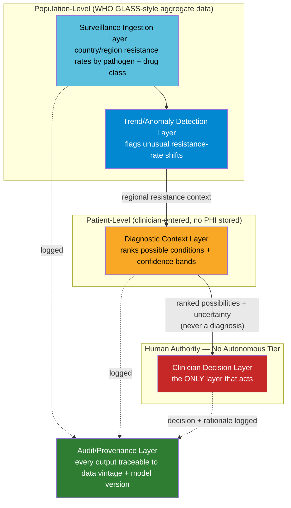

# Module 8: Vigil Architecture
### Antimicrobial Resistance Surveillance & Diagnostic Context — the Strictest Authority Boundary in the Portfolio

**Author:** Jones (AI/ML Engineer)
**Portfolio:** [ai-engineering-portfolio](https://github.com/joneslokouba-ui/ai-engineering-portfolio)
**Domain:** Population-level AMR surveillance feeding patient-level diagnostic context
**Grounded in:** WHO's Global Antimicrobial Resistance and Use Surveillance System (GLASS)

---

## Why This Module Exists

Modules 5, 6, and 7 each established a version of the same principle: a probabilistic or
automated signal must never gain unmediated authority over a consequential action. Module 5 drew
that line at the flight controller. Module 6 drew it between reversible transaction actions and
irreversible account actions. Module 7 drew it around sensing data that could never command a
connected UAV.

Module 8 pushes that same principle to its strictest form yet. In fraud detection, *some* actions
were safe to automate — approving a low-risk transaction carries bounded, recoverable cost. In
this domain, there is no such tier. A wrong autonomous nudge in a clinical context costs a life,
not a chargeback. **This module therefore has no autonomous tier at all.** Every output, at every
layer, is a ranked possibility with explicit uncertainty — never a diagnosis, never a treatment
recommendation, never an action taken on a patient. The architecture's central decision is not
*how* to bound automation — it's the case for having *none*.

## Data Grounding

This module is grounded in real, current WHO data: the 2025 GLASS report draws on data from over
23 million laboratory-confirmed infections reported by 104 countries in 2023 (110 countries
contributed data at some point between 2016 and 2023), covering resistance to 22 antibiotics
across eight priority bacterial pathogens. The report found that roughly one in six
bacteriologically confirmed bacterial infections globally involved antibiotic-resistant
pathogens, rising to about one in three for urinary tract infections, with resistance increasing
across more than 40% of monitored pathogen-antibiotic combinations between 2018 and 2023.

This module works with aggregate, country/region-level resistance data of exactly this kind —
never individual patient records, never real clinical data.

---

## System Overview



**Notice there is no arrow from any layer directly to an action.** Every path terminates at the
Clinician Decision Layer — this is the flagship decision. See
[ADR-001](adr/ADR-001-no-autonomous-tier.md).

---

## Architecture Decision Records

| ADR | Decision | Status |
|---|---|---|
| [ADR-001](adr/ADR-001-no-autonomous-tier.md) | The system never outputs a diagnosis or treatment recommendation — only ranked differential possibilities with explicit uncertainty, for clinician review | Accepted |
| [ADR-002](adr/ADR-002-data-provenance-staleness.md) | Missing or stale regional surveillance data is reported as an explicit UNKNOWN state — never interpolated silently, never treated as evidence of low resistance | Accepted |
| [ADR-003](adr/ADR-003-uncertainty-communication.md) | Ranked possibilities are displayed as qualitative confidence bands with per-item evidence and persistent non-diagnostic framing — never a bare list or numeric point estimate | Accepted |
| [ADR-004](adr/ADR-004-severity-reportability-floor.md) | Severity-flagged and WHO-reportable conditions are never omitted or buried by confidence ranking alone | Accepted |

Core architecture coverage is now 4 ADRs.

---

## Repository Structure

---

## Simulation: Proving the ADRs Hold

`sim/vigil_sim.py` is a structural proof (not a diagnostic tool, produces no real medical output)
validating all four ADRs against 11 scenarios, all passing.

| # | Scenario | ADR |
|---|---|---|
| 1 | Missing region returns explicit UNKNOWN, never a numeric default | **ADR-002 (core claim)** |
| 2 | Data older than the staleness threshold is flagged STALE | ADR-002 |
| 3 | Fresh, directly reported data is not flagged stale | ADR-002 |
| 4 | Fallback estimate is tagged distinctly with strictly lower confidence than direct data | ADR-002 |
| 5 | Output always contains 2+ ranked items under normal generation | ADR-001 / ADR-003 |
| 6 | Adversarial `force_single_answer=True` still produces 2+ items — no collapse path exists | **ADR-001 (core claim)** |
| 7 | Confidence is always a qualitative band, never a raw number | ADR-003 |
| 8 | The non-diagnostic framing header is always present, even for UNKNOWN-region output | ADR-003 |
| 9 | STALE flags on the underlying data are carried through to every ranked item, never dropped | ADR-002 + ADR-003 |
| 10 | A low-ranked watch-list condition still surfaces in the severity section, never dropped by truncation | **ADR-004 (core claim)** |
| 11 | A low-ranked non-watchlist condition can legitimately be excluded — the floor is specific, not universal | ADR-004 |

Scenario 6 is the strongest structural proof in the set: the "force a single answer" parameter is
accepted by the function but has no code path that can act on it — the same structural-ceiling
technique used for Module 7's `isac_detection_effect()`. Scenario 10/11 together prove ADR-004's
floor is deliberate and bounded, not an accidental side effect: severity-flagged conditions always
survive truncation, while ordinary low-ranked conditions can still legitimately be excluded.

Run it yourself:
```bash
cd module8-vigil-architecture/sim
python vigil_sim.py
```

---

## Repository Structure

```
module8-vigil-architecture/
├── README.md                              ← you are here
├── adr/
│   ├── ADR-001-no-autonomous-tier.md
│   ├── ADR-002-data-provenance-staleness.md
│   ├── ADR-003-uncertainty-communication.md
│   └── ADR-004-severity-reportability-floor.md
├── diagrams/
│   └── (source diagrams, mirrored from README for standalone viewing)
└── sim/
    └── vigil_sim.py                        ← 11/11 scenarios passing
```

---

## Next Steps

1. Streamlit dashboard, scoped honestly to whatever is actually built (same discipline as
   Modules 5-7).